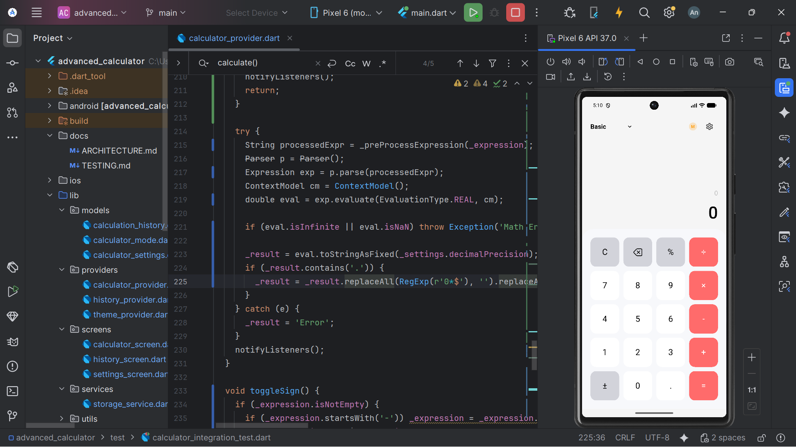
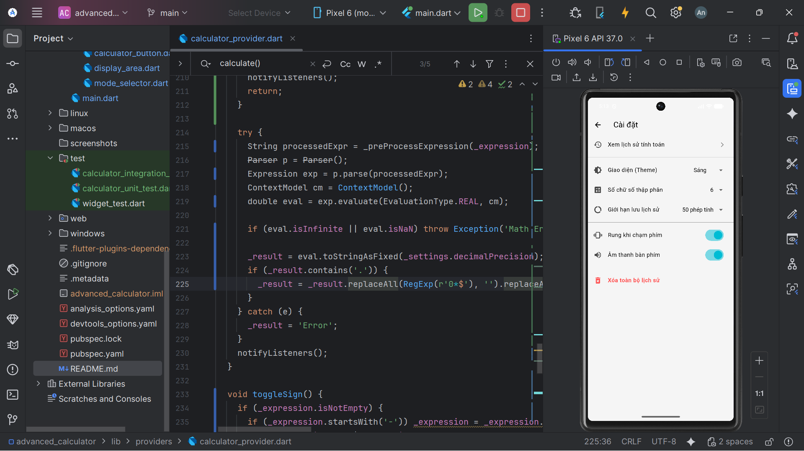

Advanced Mobile Calculator - Lab 3

📝 Mô tả dự án
Ứng dụng máy tính nâng cao được xây dựng bằng Flutter, cung cấp trải nghiệm tính toán chuyên nghiệp với đầy đủ các tính năng từ cơ bản đến chuyên sâu dành cho lập trình viên và nhà khoa học. Ứng dụng tập trung vào kiến trúc sạch (Clean Architecture), quản lý trạng thái hiệu quả bằng Provider và trải nghiệm người dùng mượt mà với các hiệu ứng animation và cử chỉ thông minh.

✨ Tính năng nổi bật 
1. Đa chế độ tính toán
- 	Basic Mode: Giao diện 4x5 đơn giản cho các phép tính hàng ngày.
- 	Scientific Mode: Giao diện 6x6 hỗ trợ đầy đủ các hàm lượng giác (sin, cos, tan), logarit, lũy thừa, căn bậc n và các hằng số toán học.
- 	Programmer Mode: Hỗ trợ chuyển đổi giữa các hệ cơ số HEX, DEC, OCT, BIN và các phép toán Bitwise (AND, OR, XOR, NOT, Shift).
2. Trình phân tích biểu thức thông minh (Expression Parser) 
-	Hỗ trợ thứ tự ưu tiên PEMDAS và dấu ngoặc lồng nhau.
-	Tự động xử lý nhân ngầm.
-	Thông báo lỗi trực quan kèm hiệu ứng rung lắc (Shake animation).
3. Quản lý lịch sử và Lưu trữ dữ liệu 
-	Lưu trữ 50 phép tính gần nhất ngay cả khi thoát ứng dụng.
-	Lưu hằng số bộ nhớ (M+, M-, MR, MC).
-	Tự động ghi nhớ chế độ máy tính, đơn vị góc (DEG/RAD) và chủ đề giao diện (Theme) của người dùng.
4. Tương tác cử chỉ và Animation 
-	Swipe to Delete: Vuốt phải trên màn hình hiển thị để xóa ký tự cuối.
-	Swipe up for History: Vuốt lên để mở nhanh màn hình lịch sử.
-	Pinch to Zoom: Thu phóng để thay đổi kích thước phông chữ hiển thị.
-	Long Press: Nhấn giữ nút "C" để xóa nhanh toàn bộ lịch sử.
-	Hiệu ứng chuyển đổi chế độ mượt mà và phản hồi rung khi chạm phím (Haptic feedback).
5. Cài đặt cá nhân hóa 
-	Tùy chọn chủ đề: Sáng, Tối hoặc theo Hệ thống.
-	Độ chính xác thập phân: Tùy chỉnh từ 2 đến 10 chữ số.
-	Bật/tắt âm thanh bàn phím và phản hồi rung.

Ảnh chụp màn hình 

Basic mode

Scientific Mode

Programmer Mode

Settings

Kiến trúc ứng dụng (Architecture)

Dự án được tổ chức theo mô hình Provider Pattern kết hợp với kiến trúc phân lớp để đảm bảo tính dễ bảo trì và mở rộng:
-	Models: Định nghĩa cấu trúc dữ liệu cho lịch sử, cài đặt và chế độ.
-	Providers: Quản lý logic tính toán, giao diện và dữ liệu (State Management).
-	Screens & Widgets: Thành phần giao diện người dùng có thể tái sử dụng.
-	Services: Xử lý lưu trữ bền vững (SharedPreferences).
-	Utils: Các hàm 

Cài đặt dự án 
1.	Clone repository:

git clone https://github.com/VanAn6504/flutter_advanced_calculator_NguyenVanAn.git

2.	Cài đặt dependencies:

flutter pub get

3.	Chạy ứng dụng:

flutter run

Kiểm thử (Testing) 

-	Unit Tests: Kiểm tra logic toán học, thứ tự ưu tiên và các trường hợp biên (chia cho 0).
-	Integration Tests: Kiểm tra luồng nhấn phím, chuyển đổi chế độ và lưu trữ dữ liệu.

Chạy lệnh test:

flutter test

Công nghệ sử dụng
-	Framework: Flutter & Dart
-	State Management: Provider 
-	Math Engine: math_expressions 
-	Storage: shared_preferences 
-	Fonts: Roboto 

Hạn chế & Hướng phát triển 
-	Hạn chế: một vài chức năng chưa hoạt động đúng theo yêu cầu vd: các nút ">>", "<<",... chưa setup file test phù hợp để test dc các tính năng.
-   Phát triển tương lai: Hỗ trợ chế độ màn hình ngang (Landscape), nhập liệu bằng giọng nói và xuất lịch sử ra file PDF.

