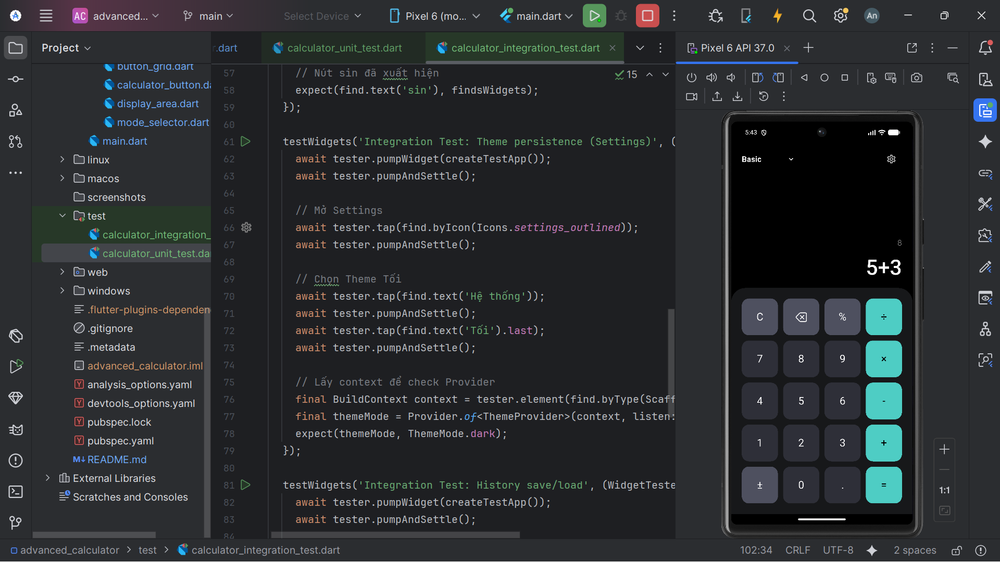
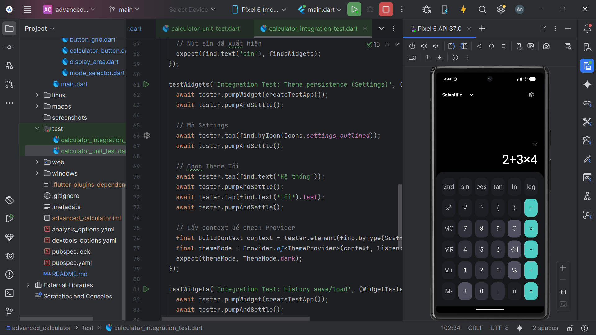
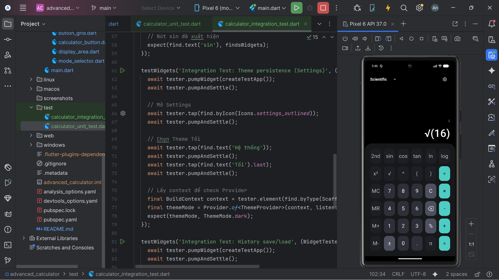
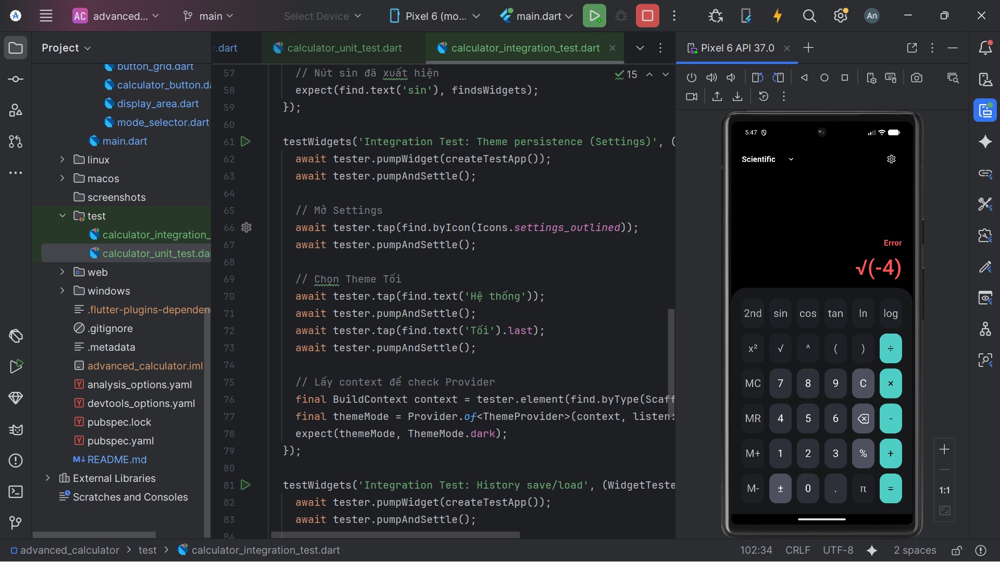

Unit Tests:
- Basic arithmetic operations

- Order of operations

x4.png)

- Memory operations: đã có nhưng khi test trên giao diện ko hiển thị rõ được

- Scientific functions
.png)

- Edge cases

Complex Test Scenarios:
- Complex expressions

- Scientific calculations

- Chain calculations

- Parentheses nesting

- Mixed scientific

- Programmer mode: thiếu chức năng chưa test được